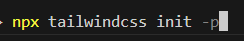
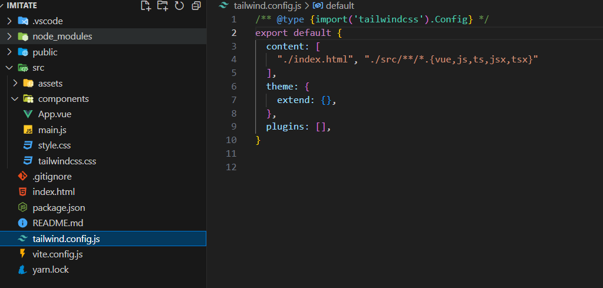
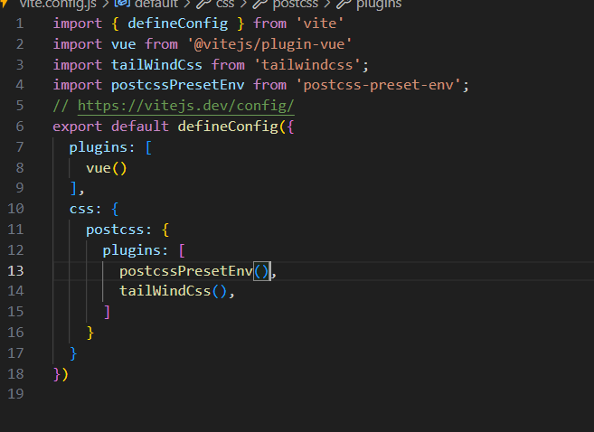
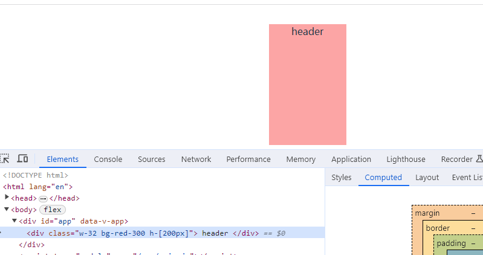

### 在vite中使用postcss

postcss官网：[www.postcss.com.cn/](https://link.juejin.cn?target=https%3A%2F%2Fwww.postcss.com.cn%2F)

postcss是一个用 JavaScript 工具和插件转换 CSS 代码的工具，postcss自身没有什么功能，只是一个平台，可以下载各种插件，从而实现一些功能！

- [**Autoprefixer**](https://link.juejin.cn?target=https%3A%2F%2Fgithub.com%2Fpostcss%2Fautoprefixer) ****自动获取浏览器的流行度和能够支持的属性，并根据这些数据帮你自动为 CSS 规则添加前缀。
- [**PostCSS Preset Env**](https://link.juejin.cn?target=https%3A%2F%2Fpreset-env.cssdb.org%2F) ****帮你将最新的 CSS 语法转换成大多数浏览器都能理解的语法，
- [CSS 模块](https://link.juejin.cn?target=https%3A%2F%2Fgithub.com%2Fcss-modules%2Fcss-modules) 能让你你永远不用担心命名太大众化而造成冲突，只要用最有意义的名字就行了。

注：[PostCSS Preset Env](https://link.juejin.cn?target=https%3A%2F%2Fpreset-env.cssdb.org%2F) 实际预设了很多好用的css插件，完全可以替代autoprefixer使用


- 一些常用的插件与作用

autoprefixer：自动添加 CSS3 前缀。
cssnano：优化和压缩 CSS。
postcss-import：通过 @import 导入 CSS 文件。
postcss-custom-properties：使用自定义属性，类似于 Sass 中的变量。
postcss-nested：允许使用嵌套规则。
postcss-mixins：类似于 Sass 中的 mixin。
postcss-css-variables：支持 CSS 变量。
postcss-preset-env：使用最新的 CSS 语法，自动添加前缀，按需加载 polyfill。
postcss-normalize：添加浏览器默认样式的规则，以消除浏览器之间的差异。
postcss-pxtorem：将像素值转换成 rem 值，使得页面更好地适配不同大小的设备。
postcss-extend：类似于 Sass 中的 @extend。
postcss-flexbugs-fixes：修复 Flexbox 布局的一些 bug

#### 1.下载依赖

```
yarn add autoprefixer postcss tailwindcss postcss-preset-env
```

#### 2.使用命令快速创建文件

```js
npx tailwindcss init -p
```





#### 3.使用tailwindcss（不用跳过）

1. 创建 **tailwindcss.css**

   ```
   @tailwind base;
   @tailwind components;
   @tailwind utilities;
   //写入以上语句
   ```

   

2. 导入到main.js中

   ```js
   import './tailwindcss.css';
   ```

   

#### 4.在vite.config.js中配置postcss



然后我们就在vite项目中配置好了postcss和tailwindcss



**tailwindcss**具体语法参考官网 [tailwindcss](https://tailwindcss.com/)