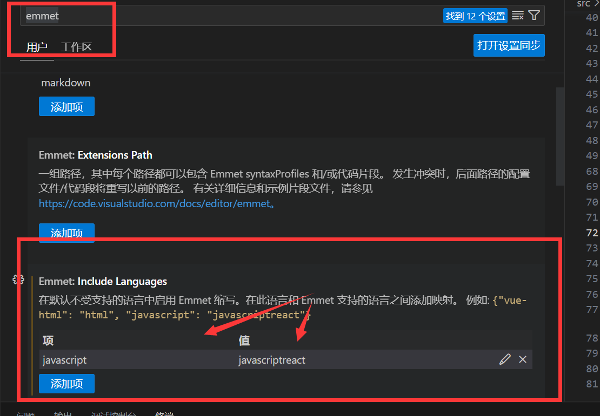
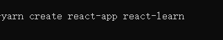

# **react**

## 认识react

## 环境配置

### emmet

配置emmet   在设置里面找到配置 添加上 javascript : javascriptreact



配置过后我们就可以在js里面书写 元素结构了   

这样当我们打上 h1 + tab键时就会自动你打出 <h1></h1>

>注意我们这样写的不是dom元素，本质上还是一个对象

```js
ReactDOM.render(<h1>Hello World</h1>,document.getElementById('root'));
```

> ReactDOM是React提供的对象，它提供的render函数类似于vue的render   可以降react的dom挂在到react的容器中
>
> 传入两个参数
>
> 1. 显示的东西
> 2. 容器

### 插件安装

>ESlint  :代码风格检查
>
>SE7 React/Redux/GraphQL/React-Native snippets :快速代码编写
>
>（就是规范的快捷代码，之后会有很难多方便的快捷键）

### 使用脚手架创建react项目

>官方：**create-react-app** 
>
>第三方：**next.js**  、**umijs**    (后续使用umijs脚手架进行学习)




### Chrome插件安装

React Developer Tools

>最好科学上网到谷歌商店下载
>
>相当于vue一样的调试工具

## JSX

### JSX简介

>什么是JSX
>
>是facebook起草的JS扩展语法
>
>1. 本质是JS对象，由于没有被收录，需要用babel编译，最终会被转换为**React.createElement**相当于一个语法糖
>   ```js
>   const h1 = React.createElement('h1',{
>       title:'我是React元素',
>   },'hello','world',...)
>   //相当于
>   <h1 title="我是React元素">hello world ...</h1>
>   ```
>
>   
>
>2. 每个JSX表达式，有且仅有一个根节点   ##
>
>  - 当我们遇见必须两个元素并列的情况下我们可以使用 **<React.Ftagment></React.Ftagment>**（Ftagment：片段）来代替根元素 不会对应真实的dom  当然可以使用它的语法糖 **<></>**
>
>    // <> <h1>hello </h1>  <h2>world</h2></>
>
>3. 每个JSX元素必须结束（XML规范）  ( / )

### JSX表达式

>使用 **{}**
>
>- **null** **false**  **undefined**  不会显示
>
>- 普通对象，不可以作为子元素 （react元素对象可以）
>
>- 数组会依次遍历 并且把数组里面的每一个元素作为子元素加进来（子元素是react元素的话，需要给子元素加上唯一的key保证唯一，不加也可以，加了更好）
>
>- 属性也可以用表达式 （属性使用小驼峰命名法）
>
>- style要当作对象进行书写（属性部分有些可以接收对象）
>
>- 防止注入攻击
>
> 1. 会自动编码：我们输入的文本会自动编码 比如加上html的标签后不会被解析成dom元素
>
> 2. **dangerouslySetInnerHTML** 要求必须写成对象后设置内容
>
>    ```html
>    <div dangerouslySetInnerHTML = {{
>         __html:conntent
>    }}></div>
>    ```

```js
const a=10,b=20;
<div>
    {a } * {b } = {a *b }
</div>
console.log(a*b) //200

//react元素对象
const  span = <span>这是一个span元素</span>

//数组
const arr = [1,2,3,4,5,6,7]
{arr}
// 1234567

const url = xxxx;
const cls = 'image'
//属性用表达式

//className 就是class

    
//style

//style里面的大括号相当于对象。。。


```

在JSX里面写**注释**需要用 **{/* */}**

### 元素不可变

>虽然JSX是一个对象 但是元素一旦被创建，就不能能被修改了
>
>底层使用**Object.freeze(obj)** 冻结了创建的对象

```js
const div = (<div title = 'fff'>
             {num}
             </div>)
div.props = 2 //报错
```

>那我们要是想改变怎么办
>
>使用**ReactDom.render(obj,dom)**重新渲染

```js
ReactDom.render(div,document.getElementById('root')）
```

**重新渲染  效率不会低 我们只是创建了一个对象 而不是修改真实dom 我们的div元素没有改变**

## 组件

>和vue组件一样的概念，方便复用，模块化
>
>React组件**首字母**必须**大写**

### 组件类型

**有两种使用方式**

#### 函数式

>直接用function定义函数 返回JSX

```jsx
function MyFuncComp(){
    return <h1>组件内容</h1>
}
//也就是因为函数调用返回的是React的dom元素  React.createElement()
//第一种使用方式  不推荐！
//这种调用方式不会生成react组件结构
ReactDom.render({MyFuncComp()},document.getElementById('root'))
//第二种使用方式
//这种方式会有react的树形组件结构
//再次提醒组件首字母必须大写 不然会被当作为普通的react元素
ReactDom.render(<MyFuncComp/>,document.getElementById('root'))
```

#### 类组件

>使用**class**创建一个类并且用**extends**来继承 ****
>
>必须提供**render()**方法，该方法必须返回React元素

```jsx
calss MyClassComp extends React.Compoent{
    render(){
        return <h1>类组件</h1>
    }
}
```

### 组件传值

#### 函数组件传值

>传递的就是参数
>
>为了统一一般取名为**props**
>
>传进来的内容会放在props这个对象中

```jsx

//子
function MyFuncComp(props){
    return <h1>组件内容，传递来的数字 ： {props.number}</h1>
}

//父
ReactDom.render(<>
                <MyFuncComp number='2' />  //传递的是字符串
                <MyFuncComp number={5} />//传递的是数字
                 <MyFuncComp ennable={true} />//传递的是布尔类型的数据
                <MyFuncComp ennable={{name:'wwww'}} />//传递的是对象
                </>
                ,document.getElementById('root'))

```

#### 类组件传值

>传递来的蚕食用构造函数 **constructor**来接受并且调用**super(props)**    
>
>**super(props)**  相当于调用了  this.props = props  将传递来的对象保存在这个对象里面	

```jsx
//子
calss MyClassComp extends React.Compoent{
    constructor(props){
        super(props) //this.props = props  将传递来的对象保存在这个对象里面
    }
    //constructor里面的其实会自动帮我们完成，可以不写
    render(){
        return <h1>类组件  {this.props.number}</h1>
        //用法多了个this
    }
}

//父
ReactDom.render(<>
                <MyClassComp number='2' />  //传递的是字符串
                <MyClassComp number={5} />//传递的是数字
                 <MyClassComp ennable={true} />//传递的是布尔类型的数据
                <MyClassComp ennable={{name:'wwww'}} />//传递的是对象
                </>
                ,document.getElementById('root'))

```

>**特别注意** : 组件不能改变自身的属性
>
>**数据属于谁谁才有权力改动**
>
>!或许我们可以在组件里面更改引用类型数据里面的数据 但是千万不要这么做 要保证数据只能在数据源那里修改

### 组件状态   State

>组件可以自行维护的数据  (**state**)
>
>**组件状态仅在类组件中有效**

如果我们想做一个倒计时，要在父组件中一直调用React.render() 是不是有点别扭

这种情况我们就可以用到组件状态

```jsx
calss MyClassComp extends React.Compoent{
    
    
    //也可以写在构造函数外边  Js Next语法  目前处于试用阶段  但是可以随便用 因为我们有babel
    state = {
        left:this.props.number
    }
    constructor(props){
        super(props) //this.props = props  将传递来的对象保存在这个对象里面
        
        //初始状态
        
      	this.state={
            //初始化我们自己的数据
            //使用了传递进来的数据初始化 （当然也可以写死)
            left:this.props.number
        }
        
        //倒计时
        this.timer = setInterval(()=>{
           //this.state.left --; 
            //这样是不可以的   react没有vue的’魔法‘  无法监控到状态发生变化 
            //重新渲染?怎么初始化
            
            //状态的变化我们需要使用 （父组件提供)
            this.setState({
                left:this.state.left-1
            })  //表示重新设置状态  状态改变
            //一旦调用 会自动触发重新渲染
            if(this.state.left == 0){
                clearInterval(this.timer)
            }
           
        },1000)
    }
   
    render(){
        return <h1>倒计时剩余时间  {this.state.left}</h1>
        //用法多了个this
    }
}
```

#### **this.setState({})**

>**this.setState({})**
>
>1. 底层是用 Object.assign() 来对state进行混入 覆盖掉原来的状态(相同覆盖，不同无影响)
>2. 一旦调用 会自动触发重新渲染

**注意**   当组件重新渲染后 它的子组件也都会跟着一起重新渲染

>**this.setState({})**    对状态的改变**可能是异步的**
>
>- 如果某个改变状态的代码处于某个**HTML元素的事件**中，则其是异步的，否则是同步
>
>  **解决**：避免出错，在**this.setState({})**中使用回调函数获得状态
>
>  ```jsx
>  this.,setState({},()=>{
>      //在这里获取最新的状态
>  })
>  ```
>
>- 在事件中同时连续使用setState时改变状态时  会出现状态改变的都是同一个状态，后续状态不能获取最新的状态
>
>  **解决**：使用函数的方式得到最新状态
>
>  ```jsx
>  this.,setState(cur=>{
>      return {
>          n:cur.n + 1
>      }
>  })
>  ```
>
>  1. 参数prev表示当前状态
>  2. 该函数的返回结果会混合掉之前的状态
>  3. 该函数是异步执行 （后续改变状态的函数会排列在它之后  就可以拿到最新的状态）
>
> **最佳实践**
>
>>1. 把所有的setState当作是异步的
>>2. 永远不信任setState调用之后的状态
>>3. 使用调用后的状态用回调函数 
>>4. 如果需要新的状态会根据之前的状态进行运算，使用函数的方式改变状态 
>
> 
>
>**React会对异步的setState进行优化，将多次的setState进行合并（将多次的状态改变完成后，在统一对state进行改变，然后再出发render)**
>
> 此时 **使用调用后的状态用的回调函数**也是会在统一改变后执行 

### Ref 

>1. 直接使用dom元素中的某个方法
>2. 直接使用自定义组件中的某个方法
>
>用法：
>
>给组件或者dom元素添加  ref  `ref = ’demo‘`
>
>使用 `this.refs.demo.xxx`
>
>（上述时字符串赋值，不推荐使用）X
>
>- ref**作用于html的组件，得到的是真实的dom**
>- ref**作用于类组件，得到的是类的实例**
>- ref**不能作用域函数组件**
>
>ref不在推荐使用字符串赋值，字符串赋值的方式将来可能被移除
>
>目前，ref推荐使用对象或是函数

#### 对象赋值

>通过 **React.createRef()**  创建一个对象  结构其实就是
>
>```jsx
>{
>current:xxx,
>}
>```
>    
>使用 `const demo = React.createRef()  `
>
>​		 `ref = 'demo'`
>
>​		 `this.demo.current.xxx`
>

#### 函数赋值 

>
>使用函数，函数的参数就是dom元素或者类的实例
>
>使用`ref = {el => {this.demo = el}}`
>
>`this.demo.xxx`
> 
>​	**函数的调用事件，什么时候调用**
>
>1. **componentDidMount**挂载完成时就可以使用且已被调用
>2. 如果ref的值发生了变动 （旧的函数被新的函数替代），分别调用旧的函数和新的函数，时间点出现在**componentDidMount**之前
>  1. 如果我们不想让它调用两次，可以在外边写一个实例方法，给ref一个实例方法，所以每次给ref的都是同一个方法，所以只会在componentDidMount挂载时调用一次
>3. 如果ref所在的组件被卸载，也会调用一次
>
> 
>
>**谨慎使用ref，最好使用react的属性啊，状态，来控制页面变化，尽量避免直接操作dom，**
>
>**能用属性和状态控制，就不要使用ref**
>
>1. 调用真实dom对象中的方法  （音频，视频暂停等...）
>2. 某个时候需要调用类组件的方法

#### Ref转发

>**forwardRef**
>
>我们在函数组件中时不能使用Ref的（没什么意义），但是我们希望得到组件内部的根元素怎么搞

```jsx
function A(props,ref){
    return <h1>组件A</h1>
}
```

1. **React.forwardRef**
   1. 传递时函数组件
   2. 返回的是一个新的组件
2. const newA = React.forwardRef(A)
   1. 如果此时我们用React.createRef()创建一个对象赋值给newA的ref，得到的是null
   2. 但是会把**ref**通过函数A的**第二个参数（props,ref)**交给A，让自行处理
3. 然后我们再把这个ref绑定到我们需要转发到的根节点上就可以拿到组件里面的东西了

```jsx

function A(props,ref){
    return <h1 ref={ref}>组件A</h1>
}

//父组件
const NewA = React.forwardRef(A)
const ARef = React.createRef()
<NewA ref={ARef}><NewA/>

componentDidMount(){
    console.log(this.ARef)
    // 这时拿到的就是A组件里面的 h1
}
```

> 类组件中怎么使用
>
> 通过一个普通属性传过去，然后组件内部使用props接收，再把这个接收到的ref传给想要获取的元素上边

```jsx
//子组件
render(){
    return <h1 ref={this.props.myfowardRef}>组件A</h1>
}

//父组件

const ARef = React.createRef()

<A myfowardRef={ARef}><A/>

componentDidMount(){
    console.log(this.ARef)
    // 这时拿到的就是A组件里面的 h1
}

```

**函数组件得通过 React.forwardRef()才能够使用**

```jsx
//封装使用
const NewA = React.forwardRef((props,ref)=>{
return <A {...props} myForwardRef={ref}></A>
})
const ARef = React.createRef()

render(){
    <NewA ref={ARef}></NewA>
}
```

**这样我们类组件也能像函数组件一样使用React.forwardRef()**

>forwardRef配合高阶组件获取到我们真实的组件

```jsx
import {A} from './components/Comps'
//高阶组件
import WithLog from './HOC/WithLog'
const AComp = WithLog(A)
const myRef = React.createRef()
render(){
    return (
    <div>
 		// 1. ref传给高阶组件      
        <AComp ref={this.myRef} xxx={xxx}></AComp>
    </div>
    )
}


//高阶组件内
render(){
    //3.结构出来forwardRef和剩余参数， forwardRef代表我们要转发的ref
    const {forwardRef,...rest} = this.props
    return (
    <>
        //4.接收forwardRef传来的ref给Comp
    	<Comp ref={forwardRef} {...rest}></Comp>    
    </>
    )
}
//2.高阶组件拿到使用 React.forwardRef 并且讲ref通过forwardRef 传给 Comp
return React.forwardRef((props,ref)=>{
    return <WithLog {...props} forwardRef=(ref)>
    </WithLog>
})
```


## 事件	

>**其实就是属性  属性传递的是函数...**
>
>比如onClick  点击事件

>```jsx
>finction handleClick(e){
>console.log('点击了',e)
>}
>
>const btn = <button onClick={handleClick} onMouseEnter={(e)=>{
>          console.log('鼠标移入了',e)
>     }}>点击</button>
>```
>
>事件参数怎么获取呢？
>
>直接在函数里面加上参数 e 就可以使用

如果没有特殊处理 **在事件处理函数中 this指向 undfinded**

处理办法

1. 使用bind函数绑定this

   > bind()方法主要就是将函数绑定到某个对象，bind()会创建一个函数赋值给函数体内的this对象的值会被绑定到传入bind()第一个参数的值  如果再后边再传入实参会依次先用实参再依次使用形参

   ```JSX
   //1.在constructor中调用   
   constructor(props){
       super(props)
       this.xxx  = this.xxx.bind(this)
   }
   //2.在传入事件时调用  (效率低 每次重新渲染都会产生新的函数)
   onClick = {this.xxx  = this.xxx.bind(this)}
   
   ```

2. 使用箭头函数

   >箭头函数 **this** 本身就指向外部

   ```jsx
   //1.在传入事件时函数用箭头函数
   onClick = {()=>{}}
   //2.函数定义时不用function  用箭头函数  （这样写xxx不在原型上 而是在对象上）
   xxx= (()=>{
   })
   ```


## 组件生命周期

>生命周期：组件**从诞生到销毁经历一系列的过程**
>
>React在组件的生命周期中提供了一系列的钩子函数（类似于事件），可以让开发者在函数中注入代码，这些代码会在适当的时候去运行
>
>**类组件才有生命周期**

### 旧版生命周期 		<16.0.0

1. 初始化阶段（**constructor**）
   1. 初始化属性和状态   
   2. 除非组件被销毁，**同一个组件对象只会创建一次**
   3. 不能调用 `setState({})`
2. 组件即将被挂载(**componentWillMount**)（基本不用，新版被砍掉）
   1. 和构造函数一样 ，只会运行一次
   2. 可以使用`setState({})` 但是避免bug  不允许使用
   3. 容易出bug  新版被砍掉
3. **渲染** （**render**）
   1. 返回一个虚拟Dom，会被挂载到虚拟DOM树中，最终渲染到页面的真实DOM中
   2. 严禁调用 setState 会导致无限递归渲染
   3. **render可以执行多次**，需要重新渲染，就重新运行
4. **挂载完成** （**componentDidMount**）
   1. 只会执行一次
   2. 可以使用setState
   3. 通常情况下，会将网络请求、启动计时器等一开始需要的操作，书写到该函数中
5. **更新阶段（下面就是更新阶段的函数了） ⬇**
6. 接收到新的属性值时（**componentWillReceiveProps(nextProps)**）（基本不用，新版被砍掉）
   1. 参数为设置的新的属性对象
   2. 不推荐使用
7. **是否要重新渲染该组件**（**shouldComponentUpdate(nextProps,nextState)**）
   1. 指示React是否要重新渲染该组件，通过返回true和false来指定
   2. 默认情况下，会直接返回true
   3. 接受两个参数 ，新的属性对象和状态对象
   4. 可以做性能优化
8. 组件即将被重新渲染 （**componentWillUpdate**）（基本不用，新版被砍掉）
9. 渲染**render**(只要组件重新渲染，都会调用render)
10. 组件已完成渲染(**componentDidUpadate(prevProps,prevState)**)
    1. 往往在该函数中使用dom操作改变一些元素
11. **组件被销毁** （**componentWillUnmount**）
    1. 通常在该函数中销毁一些组件依赖的资源，比如计时器

### 新版生命周期  		>=16.0.0

>上述表明被砍掉的已经不复存在了
>
>**不要让一个组件即来自于属性又来自于状态 **（砍掉componentWillReceiveProps(nextProps)的原因，给了新的getDerivedStateFromProps）

1. 从属性中获取最新的状态 getDerivedStateFromProps
   1. 通过参数可以获取新的属性和状态
   2. 该函数时静态的 （不能使用this）
   3. 该函数的返回值会覆盖掉组件的状态
   4. 该函数几乎没什么用...........
2. **获取更新前的快照**  （**getSnapshotBeforeUpdate**）
   1. 真实的DOM构建完成，但还未真实渲染到页面中（渲染之前）
   2. 在该函数中，通常用于实现一些附加的dom操作
   3. 该函数的返回值，会作为 **componentDidUpadate**的第三个参数

### 传递元素内容

>组件可以通过属性传递元素内容
>
>Comp内部使用props接收
>
>但是这种写法是不怎么符合我们写html的习惯的
>
>所以React给我们提供了一种语法糖  写在组件中间的值会被当做 **children**属性进行传递

```jsx
<Comp html={<h1>我爱前端</h1>} ></Comp>

<Comp>
	<h1>我爱前端</h1>
</Comp>
==
<Comp children={<h1>我爱前端</h1>}>
</Comp>  
```


### 属性默认值

>使用 **defaultProps**
>
>```jsx
>组件名.defaultProps={
>h:5,
>z:5,
>y:5
>}
>```
>
>使用了**defaultProps** 之后  
>
>1. 函数组件**调用时**会将传入的**props和设置的默认的进行混合**
>2. 类组件是在调用**constructor()**之前进行混合 （是使用类组件时进行混合，出初始化完成后交给props ,调用构造函数之前就已经混合完成了）
>
>类组件中也可以使用 **static**关键字进行设置默认值
>
>```js
>static defaultProps{
>   h:5,
>   z:5,
>   y:5
>}
>```
>
>

### 属性类型检查 

> `prop-types` : 来自于React官方的库
>
> 对**组件**使用金静态属性  `propTypes`告知React
>
> **isRequired** :必填
>
> ```jsx
> xxx组件名.propTypes = {
> h:propTypes.number.isRequired
> //属性h的必须是number并且必须赋值
> }
> //类型太多了~记不过来  后续补 不会上网搜~~~~
> ```
>
> **自定义属性检查**
>
> 属性：
>
> 1. props ：所有的属性对象
> 2. propName ：当前验证的属性名字
> 3. componentName ： 组件的名称
>
> ```jsx
> h:function(props,propName,componentName){
>     const val = props[propName]
>     if(val == xxxx){
>         return newError('xxxxxxx')
>     }
> }
> ```
>
> 

## 表单

>受控组件和非受控组件
>
>**受控组件**：组建的使用者，有能力完全控制该组件的行为和内容。通常情况下，受控组件往往没有自身的状态，其内容完全收到属性的控制
>
>**非受控组件**：组建的使用者，没有能力控制该组件的行为和内容，组件的行为和内容完全自行控制
>
>**表单组件默认情况下是非受控组件**

```jsx
<input value="123" />
//如果我们这样写 表单的value值是不受控制的，此时我们没办法修改
//这时react也会给我们警告

//我们可以用过使用State，并且添加onChange事件来将它变为可控的

State = {
    val:''
}
<input value={this.state.val} onChange={e =>{
        this.state.val = e.target.value
    }} />
```

**其余表单元素类同~  （JS主打一个灵活）**

>我们每个表单元素用**onChange** 每次写比较烦人 那么我们可以将onChange里面的函数抽取出来

```jsx
hanldeChange = e =>{
    let val = e.target.value   //读取表单的值
    let name = e.target.name  //读取表单的name属性
    this.setState({
        [name]:val
    })
}
//此函数表单（多选框除外）通用~

<input value = {this.state.val} onChange={hanldeChange} />


//多选框进行特殊处理


hanldeChange = e =>{
    let val = e.target.value   //读取表单的值
    let name = e.target.name  //读取表单的name属性
    if(e.target.type === 'checkbox'){
        //对val进行特殊处理
        if(e.target.checked){
            val = [..this.state.xxx,val]
        }else{
            val =this.state.xxx.filter(item => item !== val)
        }
    }
    this.setState({
        [name]:val
    })
}
```

## 高阶组件  **HOC**

>HOF：Higher-Order Function  高阶函数，以函数作为参数，并返回一个函数
>
>HOC: Higher-Order Compoent  高阶组件，以组件作为参数，并返回一个组件

```jsx
function(func){
    return function(){
        
    }
}
//高阶函数

export default function withTest(comp){
    return class  extends React.Component{
       
    }
}

function A(){
    return <h1>A</h1>
}
const B = withTest(A)
//高阶组件
```

> **通常可以利用HOC实现横切关注点**
>
> #20个组件，每个组件在创建和销毁组件时，需要作日志记录
>
> #20个组件，它们需要显示一些内容，得到的数据结构完全一致
>
> 一般做功能增强的，一般不做显示

注意

1. 不要在render中使用高阶组件
2. 不要在高阶组件中更改传入的组件

示例 判断组件是否登录

```jsx
//HOC高级组件
export default function withLogin(comp){
    //LoginWrapper.xxxx = xxx
    return function LoginWrapper(props){
       if(props.isLogin){
           return <Comp {...props} />
       }
        return null
    }
}
```

## Context 上下文

> 上下文，表示做某一些事情的环境
>
> 1. 当某个组件创建了上下文之后，上下文中的数据，会被所有后代组件共享
> 2. 如果某个组件依赖了上下文，会导致该组件不再纯粹（外部数据进来源于属性props）
> 3. 一般情况下，用于第三方组件（通用组件）

### 旧版API（了解，后续可能被移除）

只有类组件才可以创建上下文

1. 给类组件书写静态属性  **childContextTypes** 使用该属性对上下文中的数据类型进行约束

2. 添加实例方法 **getChildContext** ，该方法返回的对象，即为上下文中的数据，该数据必须满足类型约束，该方法会在每次**render**之后运行。

   ```jsx
   //类组件中
   //使用childContextTypes对上下文中的数据类型进行约束
   static childContextTypes = {
       a:PropTypes.number,
       b:PropTypes.string.isRequired,
   }
   
   //得到上下文中的数据
   getChildContext(){
       return {
           a:123,//this.state.a
           b:'abcdefg' //this.state.b
       }
   }
   
   ```

3. 使用上下文中的数据

   1. 如果要是使用上下文中的数据，组件必须有一个静态属性 **contextTypes** ，该属性描述了需要获取的上下文中的数据类型
   2. 在**constructor**的第二个参数来获取上下文 （或者3）
   3. 从组件中的**context属性**中获取

   ```jsx
   //在这里声明需要使用那些上下文的数据
   static contextTypes = {
       a:propTypes.number
   }
   
   constructor（props,context){
       super(props);
       console.log(context)
   }
   
   //或者
   constructor（props,context){
       super(props,context); 
       console.log(this.context)  //注意这样是this.context
   }
   ```

4. 在函数组件中，通过第二个参数获取上下文

   ```jsx
   function myComp(props,context){
       return <div>
       	<h1> {this.context.xxx} </h1>
       </div>
   }
   
   myComp.contextTypes = {
       xxx:propTypes.number
   }
   ```

5. 上下文的数据变化

   > 上下文中的数据不可以直接变化，最终都是通过状态的改变

   ```jsx
   getChildContext(){
       return {
           a:this.state.a,//this.state.a
           b:this.state.b //this.state.b
       }
   }
   
   this.setState({
       a:this.state.a + 1
   })
   //调用setState  会重新运行getChildContext
   ```

6. 子组件中改变上下文

   > 办法：**在上下文中加入一个一个处理函数**，可以用于后代组件更新上下文的数据

   ```jsx
   getChildContext(){
       return {
           a:this.state.a,//this.state.a
           b:this.state.b //this.state.b,
           onChange(newA){
               this.setState({
                   a:newA
               })
           }
       }
   }
   //子组件调用onChange
   ```

**数据不管怎样都是从上往下流，不能从下往上流**

### 新版API


## umi.js

>一个react框架（企业级）

全局安装 `yarn global add umi`

>提供了一个命令行工具:**umi**  ，通过该命令可以对umi工程进行操作
>
>umi还可以使用对应的脚手架

- 约定式路由

  >在pages里面的文件会被自动添加到路由  

