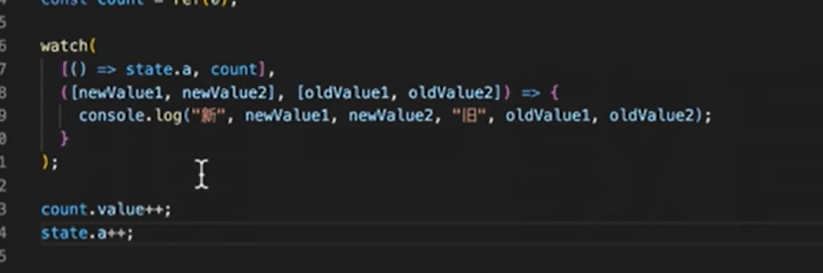

## vue

### vue响应式原理

>vue2中就是用了**Object.defineProperty()**中的 **get() set()** 对数据进行处理
>
>其实就是当用户给data里面的属性赋值的时候调用函数去更新页面

```js
const user = {
    name:'567',
    age:23
}
//更新页面上的name
function RefreshName(){
    ~~~~~
}
//更新页面上的age
function RefreshAge(){
    ~~~~~
}

 //然后我们将这个对象
```

### vue3实现路由缓存


```
<router-view  v-slot="{ Component }">
      <!-- include它会根据组件的 name 选项进行匹配，所以组件如果想要条件性地被 KeepAlive 缓存，就必须显式声明一个 name 选项。 -->
        <keep-alive :include="'index'">
           <component :is="getComponent(Component)"  />
        </keep-alive>
</router-view>
```

其中include传入需要缓存的组件名字  vue3中使用setup会自动讲文件名作为组件名

### <component>

一个用于渲染动态组件或元素的“元组件”。

- ```
  interface DynamicComponentProps {
    is: string | Component
  }
  ```

- **详细信息**

  要渲染的实际组件由 `is` prop 决定。

  - 当 `is` 是字符串，它既可以是 HTML 标签名也可以是组件的注册名。
  - 或者，`is` 也可以直接绑定到组件的定义。

###  watch监听多个对象



### 生命周期v2  vs  v3


## Vue3

### vue3传递多个修饰符  使用方法


### 异步组件

#### 定义异步组件


#### 延时


#### 设置占位组件LoadingComponent

加载中的时候先展示LoadingComponent


#### 出错组件ErrorComponent


### Teleport 将组件的dom移动到指定位置


