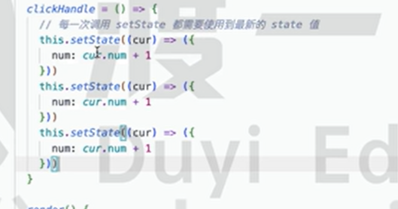
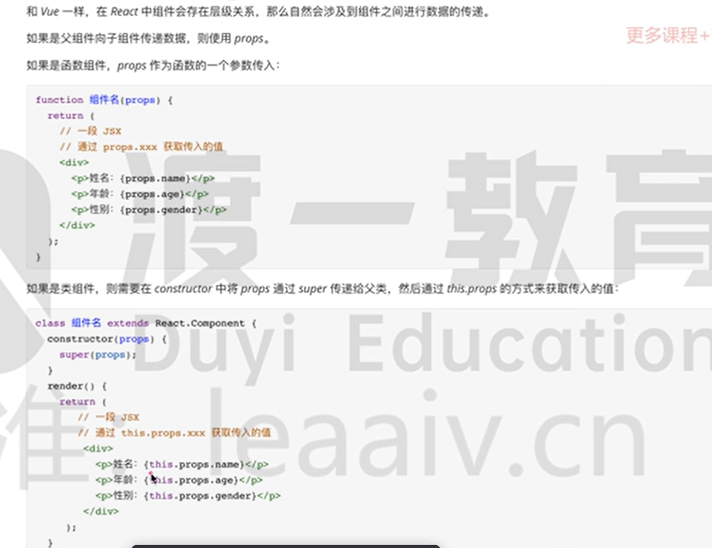
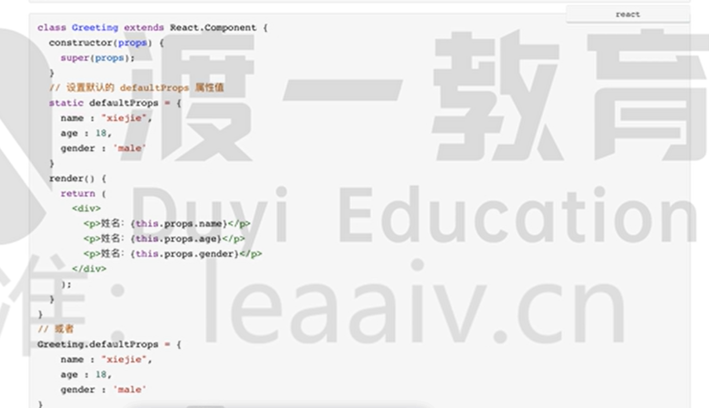
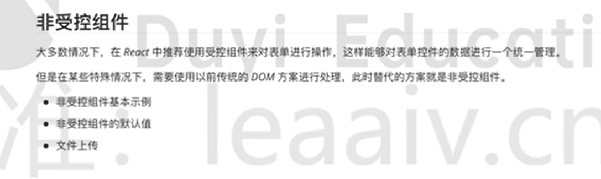

# react

`react主要用于构建ui的JavaScript库`

## react重大更新

react16 ：出现了fiber，整个更新可中断、可分片、具有优先级

react 16.8：退出了Hooks，标志着从类组件正式转为函数组件

react17：过渡版本

react18: 

>transiton
>
>suspense
>
>新的Hooks
>
>offscreen
>
>...

## react特点

1. 声明式

2. 组件化

3. 一次学习，跨平台编写
4. 单向数据流
5. 虚拟dom
6. diff算法

package和package-lock的区别

package-lock记录每一个依赖的版本

# react基础语法

在react中 使用jsx来描述页面

1. jsx只允许一个根节点（支持空标签<>)
2. jsx中使用js表达式。写在{   }里面
3. 属性值指定为字符串字面量，或在属性值中插入一个js表达式   （对比vue不用加：  加的是{}
4. style对应样式对象，class要写做className
5. 注释需要写在花括号中 { /* */ }
6. jsx允许在模板中插入数组，数组会自动展开所有成员

## createElement 方法

`jsx是一种js的语法扩展，babel会把jsx转译为一个名为React.createElement函数调用`

```
React.createElement(type,[props],[...children])
```

参数说明：

1. type:创建的React元素类型 （可选值有：标签名字符串、React组件）
2. props ：React元素的属性
3. children：React元素的子元素

例如，下面两种代码作用完全是相同的

```
<h1 className="y1">'hello,world!<h1/>

React.createElement(
'h1',
{className:'y1'},
'hello,world!'
)
```

`可以看出 jsx本质就是React.createElement的语法糖`

# 组件与事件绑定

### react中的组件

#### 通过类名创建组件

```
class 类名 extends React.component(
	render(){
		return {
			//jsx
		}
	}
)
```

#### 通过函数创建组件

```
function 组件名（）{
	return {
		//jsx
	}
}
```

 `早起函数组件称之为无状态组件，一般用于纯ui展示，里面不会有复杂的逻辑`

 `react16.8之后推出hooks后，都是用的函数组件`

### react类组件绑定事件

```
<组件 onClick={clickHandle} > </组件>
```

`事件使用驼峰命名法`

react中无法使用return  false来阻止默认行为

`只有使用e.preventDefault()来阻止默认行为`

`react组件中的e是一个合成事件对象，不是原生的，原生的通过e.nativeEvent拿到原生事件对象`


`this的修正只针对类组件`

#### 向事件处理程序传参

1. 箭头函数
2. function.prototype.bind


### 组件状态

组件状态写在 this.state中


`this.setState可能是异步的，可能会将react的异步调用合并成一个`

如果改变状态的代码（**this.setState**）处于某个html元素事件中，则其是异步的，否则是同步


- this.setState第二个参数是回调函数，它会在state更新后调用

- 如果新的状态需要根据上一次的状态来改变，使用函数的方式来调用
- 


#### props



react使用  props.children 可以实现类似于vue的插槽功能

`react使用defaultprops来给props 默认值`

函数组件


类组件还可以写在static里面



#### props类型检查


### 状态提升

`其实就是类似vue中的子传父，子组件通过emit触发父组件的方法来修改父组件的状态`

父组件通过props传递给子组件一个函数，子组件通过props.xxx()来调用父组件传来的方法  进而改变父组件的状态

在官网称之为“状态提升”

## 表单

#### 受控组件


### 非受控组件




`如果想给非受控初始值，需要使用defaultValue赋值`

### react函数组件 

