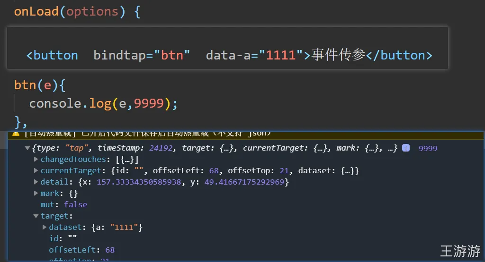
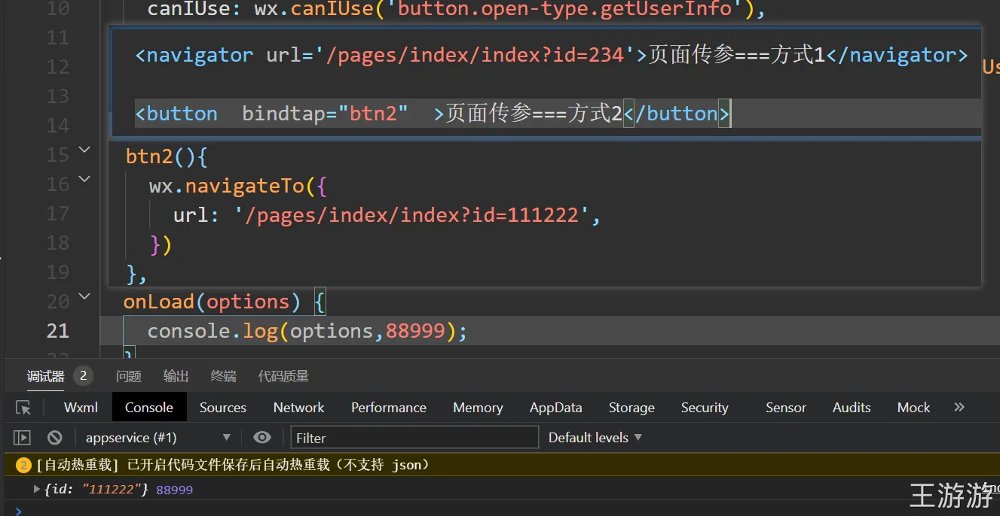
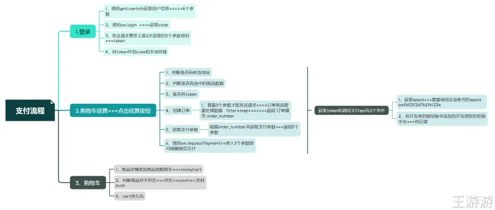
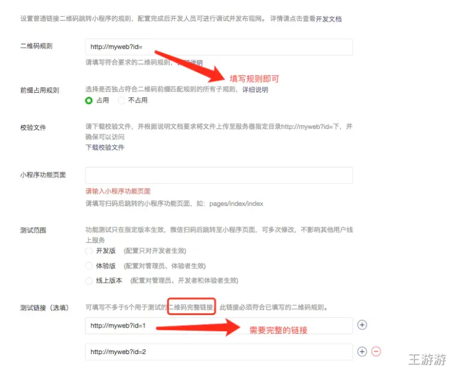

# 17-前端面试题之小程序篇

 一、小程序篇 

 1.请谈谈微信小程序主要目录和文件的作用？ 

project.config.json：项目配置文件，用的最多的就是配置是否开启https校验App.js：设置一些全局的基础数据等App.json：底部tab，标题栏和路由等设置App.wxss：公共样式，引入iconfont等pages：里面包含一个个具体的页面index.json：配置当前页面标题和引入组件index.wxml：页面结构index.wxss：页面样式表index.js：页面的逻辑，请求和数据处理

 2.请谈谈wxml与标准的html的异同？ 

都是用来描述页面的结构都由标签，属性等构成标签名字不一样，且小程序标签更少，单一标签更多多了一些 wx:if 这样的属性以及{{}} 这样的表达式WXML仅能在微信小程序开发者工具中预览，而HTML可以在浏览器内预览组件封装不同，WXML对组件进行了重新封装小程序运行在JS Core内，没有DOM树和windiw对象，小程序中无法使用window对象和document对象。

 3.请谈谈WXSS和CSS的异同？ 

都是用来描述页面的样子WXSS具有CSS大部分的特性，也做了一些扩充和修改WXSS新增了尺寸单位，WXSS在底层支持新的尺寸单位rpxWXSS仅支持部分CSS选择器WXSS提供全局样式与局部样式

 4.你是怎么封装微信小程序的数据请求的？ 

在根目录下创建util目录及api.js文件和apiConfig.js文件在apiConfig.js封装基础的get，post和put，upload等请求方法，设置请求体，带上token和异常处理等在api中引入apiConfig.js封装好的请求方法.根据页面数据请求的urls，设置对应的方法并导出在具体的页面中导入或将所有的接口放在统一的js文件中并导出在app.js中创建封装请求数据的方法在子页面中调用封装的请求数据

 5.小程序页面之间有哪些（传值）传递数据的方法？ 

1.使用全局变量实现数据传递

2.页面跳转或重定向时，使用url带参数传递数据

3.使用组件模板 template传递参数

4.使用缓存传递参数

5.使用数据库传递参数或给html元素添加data-*属性来传递值，然后通过e.currentTarget.dataset或onload的param参数获取（data- 名称不能有大写字母，不可以存放对象）设置id 的方法标识来传值，通过e.currentTarget.id获取设置的id值，然后通过设置全局对象的方式来传递数据在navigator中添加参数数值

事件传参：

页面传参：

 6.请谈谈小程序的双向绑定和vue的异同？ 

大体相同，但小程序之间this.data的属性是不可以同步到视图的，必须调用this.setData()方法

 7.请谈谈小程序的生命周期函数 

onLoad()页面加载时触发，只会调用一次，可获取当前页面路径中的参数onShow()页面显示/切入前台时候触发，一般用来发送数据请求onReady()页面初次渲染完成时触发，只会调用一次，代表页面已可和视图层进行交互onHide()页面隐藏/切入后台时触发，如底部tab切换到其他页面或小程序切入后台等onUnload()页面卸载时触发，如redirectTO或navigateBack到其他页面时

 8.简述微信小程序原理 

小程序本质就是一个单页面应用，所有的页面渲染和事件处理，都在一个页面内进行，但又可以通过微信客户端调用原生的各种接口；它的架构，是数据驱动的架构模式，它的UI和数据是分离的，所有的页面更新，都需要通过对数据的更改来实现；它从技术讲和现有的前端开发差不多，采用JavaScript、WXML、WXSS三种技术进行开发；功能可分为webview和APPService两个部分，webview主要用来展示UI，appservice用来处理业务逻辑，数据及接口调用，它们在两个进程中进行，通过系统层JSBridge实现通信，实现UI的渲染，事件处理；webview用来展现UI，appService有来处理业务逻辑、数据及接口调用；两个部分在两个进程中运行，通过系统层JSBridge实现通信，实现UI的渲染、事件的处理等。javaScript的代码是运行在微信App中的，因此一些h5技术的应用需要微信APP提供对应的API支持wxml 微信自己基于xml语法开发的，因此在开发时只能使用微信提供的现有标签，html的标签是无法使用的wxss具有css的大部分特性，但并不是所有都支持，没有详细文档（wxss的图片引入需要使用外链地址，没有body，样式可以使用import导入）

 9.请谈谈原生开发小程序，wepy，mpvue的对比？ 

个人认为，如果是新项目，且没有旧的 h5 项目迁移，则考虑用小程序原生开发，好处是相比于第三方框架，坑少。而如果有 老的 h5 项目是 vue 开发 或者 也有 h5 项目也需要小程序开发，则比较适合 wepy 或者 mpvue 来做迁移或者开发，近期看wepy几乎不更新了，所以推荐美团的mpvue。而如果如果团队前端强大，自己做一套框架也没问题。

 10.简单描述下微信小程序的 相关文件类型 

1.

wxml 模板文件，是框架设计的一套标签预言，结合基础组件，事件系统，可以构建出页面的结构wxss 样式文件，是一套样式语言，用于描述WXML的组件样式js脚本逻辑文件。逻辑处理网络请求json配置文件，小程序设置，如页面注册，页面标题及tabBar2.

app.json 整个小程序的全局配置，包括：

pages:[所有页面路径]

网络设置（网络超时事件）

页面表现（页面注册）

window：（背景色，导航样式，默认标题）

底部tab等

3.

app.js 监听并处理小程序的生命周期函数，声明全局变量

4.

app.wxss 全局配置的样式文件

 11.那些方法来提高微信小程序的应用速度？ 

提高页面的加载速度用户行为预测减少默认的data的大小组件化方案

 12.分析微信小程序的优劣势？ 

优势：

容易上手，基础组件库比较全，基本不需要考虑兼容问题开发文档比较完善，开发社区比较活跃，支持插件式开发良好的用户体验，无需下载，通过搜索和扫一扫就可以打开，打开速度快，安卓上可以添加到桌面，与原生APP差不多开发成本比APP要低为用户提供良好的保障（小程序发布，严格是审查流程）劣势：

限制较多，页面大小不能超过1M，不能打开超过5个层级的页面样式单一，部分组件已经是成型的，样式不可修改，例如：幻灯片，导航推广面窄，不能分享朋友圈，只能通过分享给朋友，附加小程序推广依托与微信，无法开发后台管理功能后台调试麻烦，因为api接口必须https请求且公网地址真机测试，个别安卓和苹果表现迥异，例如安卓的定位功能加载很慢

 13.微信小程序和H5的区别？ 

运行环境不同（小程序在微信运行，h5在浏览器运行）开发成本不同（h5需要兼容不同的浏览器）获取系统权限不同（系统级权限可以和小程序无缝衔接）应用在生成环境的运行速度流程（h5需不断对项目优化来提高用户体验）

 14.怎么解决微信小程序的异步请求问题？ 

在回调函数中调用下一个组件的函数

app.js

success:function(info){

   that.apirtnCallback(info)

}index.js

onLoad:function(){

   app.apirtnCallback = res =>{        console.log(res)    }

}

 15.小程序关联微信公众号如何确定用户的唯一性？ 

使用wx.getUserlnfo方法 withCredentials为true时，可获取encryptedData，里面有union_id，后端需要进行对称解密

 16.使用webview直接加载要注意那些事项？ 

必须要在小程序后台使用管理员添加业务域名h5页面跳转至小程序的脚步必须是1.3.1以上微信分享只可以是小程序的主名称，如要自定义分享内容，需小程序版本在1.7.1以上h5的支付不可以是微信公众号的appid，必须是小程序的appid，而且用户的openid也必须是用户和小程序的

 17.小程序调用后台接口遇到那些问题？ 

数据的大小限制，超过范围会直接导致整个小程序崩溃，除非重启小程序小程序不可以直接渲染文章内容这类型的html文本，显示需要借助插件注：插件渲染会导致页面加载变慢，建议在后台对文章内容的html进行过滤，后台直接处理批量替换p标签div标签为view标签，然后其他的标签让插件来做

 18.微信小程序如何实现下拉刷新？ 

用view代替scroll-view，设置onPullDownRefresh函数实现

 19.webview中的页面怎么跳转回小程序? 

wx.miniProgram.navigateTo({ url:'pages/login/login'+'$params'})//跳转到小程序导航页面wx.miniProgram.switchTab({ url:'/pages/index/index'})

 20.bindtap和catchtap的区别？ 

bind事件绑定不会阻止冒泡事件向上冒泡catch事件绑定可以阻止冒泡事件向上冒泡

 21.简述wx.navigateTo(),wx.redirectTo(),wx.switchTab(),wx.navigateBack(),wx.reLaunch()的区别？ 

在wxml页面中：跳转新页面，在当前页打开，切换到首页Tab在js页面中：分为应用内的页面，和tabBar页面如果上述跳转遇到跳转失败或者无效的问题，请访问：wx.navigateTo/wx.redirectTo无效

 22.小程序和Vue写法的区别？ 

遍历的时候：小程序wx:for="list",而Vue是v-for="item in list"调用data模型（赋值）的时候：

小程序：this.data.item // 调用，this.setDate({item:1})//赋值

Vue：this.item //调用，this.item=1 //赋值

 23.小程序与原生App那个好？ 

各有各自的优点，都又有缺点

小程序的优点：

基于微信平台开发，享受微信自带的流量，这个优点最大无需安装，只要打开微信就能用，不占手机内存，体验好开发周期段，一般最多一个月就可以上线完成开发所需的资金少，所需资金是开发原生APP的一半不到小程序名称是唯一的，在微信的搜索里权重很高容易上手，只要之前有HTML+CSS+JS基础知识，写小程序基本没有大问题基本不需要考虑兼容性问题，只要微信可以正常运行的机器，就可以运行小程序发布，审核高效，基本上午发布审核，下午就审核通过，升级简单，支持灰度发布开发文档完善，社区活跃支持插件式开发，一些基本功能可以开发成插件，供多个小程序使用缺点：

局限性很强（比如页面大小不能超过1M，不能打开超过5个层级的页面，样式单一，小程序的部分组件已经是成型的了，样式不能修改，比如幻灯片，导航）只能依赖于微信依托与微信，无法开发后台管理功能不利于推广，推广面窄，不能分享朋友圈，只能分享给朋友，附近小程序推广，其中附加小程序也收到微信限制后台调试麻烦，因为API接口必须https请求，且公网地址，也就是说后台代码必须发布到远程服务器上；当然我们可以修改host进行dns映射把远程服务器转到本地，或者开启tomcat远程调试；不管怎么说终归调试比较麻烦前台测试有诸多坑，最头疼莫过于模拟器与真机显示不一致js引用只能使用绝对路径，不能操作DOM原生App优点：

原生的相应速度快对于有无网络操作时，譬如离线操作基本选用原生开发需要调用系统硬件的功能（摄像头，拨号，短信蓝牙..）在无网络或者弱网情况下体验好原生App缺点：

开发周期长，开发成本高，需要下载

 24.小程序的发布流程（开发流程） 

参考：https://www.cnblogs.com/ssrstm/p/6855572.html

注册微信小程序账号获取微信小程序的AppID下载微信小程序开发者工具创建demo项目去微信公众号配置域名手机浏览代码上传提交审核小程序发布

 25.webview中的页面怎么跳回小程序中？ 

首先，需要在你的html页面中引用一个js文件

//然后为你的按钮标签注册一个点击事件$(".kaiqi").click(function(){ wx.miniProgram.redirectTo({url: '/pages/indexTwo/indexTwo'})});// 这里的redirectTo跟小程序的wx.redirectTo()跳转页面是一样的，会关闭当前跳转到页面，换成navigateTo，跳转页面就不会关闭当前页面

 26.小程序授权登录流程 

（授权，微信登录获取code，微信登录，获取 iv , encryptedData 传到服务器后台，如果没有注册，需要注册。）

 27.小程序支付如何实现？ 

小程序注册，要以公司的身份去注册一个小程序，才有微信支付权限绑定商户号在小程序填写合法域调用wx.login()获取appid调用wx.requestPayment({ 'timeStamp': '',//时间戳从1970年1月1日00:00:00至今的秒数,即当前的时间 'nonceStr': '',//随机字符串，长度为32个字符以下。 'package': '',//统一下单接口返回的 prepay_id 参数值，提交格式如：prepay_id=* 'signType': 'MD5',//签名类型，默认为MD5，支持HMAC-SHA256和MD5。注意此处需与统一下单的签名类型一致 'paySign': '',//签名,具体签名方案参见微信公众号支付帮助文档; 'success':function(res){},//成功回调 'fail':function(res){},//失败 'complete':function(res){}//接口调用结束的回调函数（调用成功、失败都会执行）})

 28.小程序还有那些功能？ 

客服功能，录音，视频，音频，地图，定位，拍照，动画，canvas

常见问题：rpx：小程序的尺寸单位，规定屏幕为750rpx，可适配不同分辨率屏幕本地资源无法通过wxss获取：background-image：可以使用网络图片，或者base64，或者使用标签wx.navigateTo无法打开页面：一个应用同时只能打开5个页面，请避免多层级的交互方式，或使用wx.redirectTotabBar设置不显示：1.tabBar的数量少于2项或超过5项都不会显示。2.tabBar写法错误导致不会显示。3.tabBar没有写pagePath字段（程序启动后显示的第一个页面）

 二、小程序加强篇 

 1. 简单描述下微信小程序的相关文件类型 

微信小程序项目结构主要有四个文件类型

●WXML（WeiXin Markup Language）是框架设计的一套标签语言，结合基础组件、事件系统，可以构建出页面的结构。内部主要是微信自己定义的一套组件

●WXSS (WeiXin Style Sheets)是一套样式语言，用于描述 WXML 的组件样式

●js 逻辑处理，网络请求

●json 小程序设置，如页面注册，页面标题及tabBar

主要文件

●app.json 必须要有这个文件，如果没有这个文件，项目无法运行，因为微信框架把这个作为配置文件入口，整个小程序的全局配置。包括页面注册，网络设置，以及小程序的 window 背景色，配置导航条样式，配置默认标题

●app.js 必须要有这个文件，没有也是会报错！但是这个文件创建一下就行 什么都不需要写以后我们可以在这个文件中监听并处理小程序的生命周期函数、声明全局变量

●app.wxss 可选

 2. 简述微信小程序原理 

微信小程序采用 JavaScript、WXML、WXSS 三种技术进行开发,本质就是一个单页面应用，所有的页面渲染和事件处理，都在一个页面内进行，但又可以通过微信客户端调用原生的各种接口微信的架构，是数据驱动的架构模式，它的 UI 和数据是分离的，所有的页面更新，都需要通过对数据的更改来实现 小程序分为两个部分 webview 和 appService 。其中 webview 主要用来展现 UI ，appService 有来处理业务逻辑、数据及接口调用。它们在两个进程中运行，通过系统层 JSBridge 实现通信，实现 UI 的渲染、事件的处理

 3. 小程序的双向绑定和vue哪里不一样 

小程序直接 this.data 的属性是不可以同步到视图的，必须调用：

 4. 小程序的wxss和css有哪些不一样的地方 

WXSS 和 CSS 类似，不过在 CSS 的基础上做了一些补充和修改

●尺寸单位 rpx

rpx 是响应式像素,可以根据屏幕宽度进行自适应。规定屏幕宽为 750rpx。如在 iPhone6 上，屏幕宽度为 375px，共有 750 个物理像素，则 750rpx = 375px = 750 物理像素

●使用 @import 标识符来导入外联样式。@import 后跟需要导入的外联样式表的相对路径，用;表示语句结束

 5. 小程序页面间有哪些传递数据的方法 

●使用全局变量实现数据传递

在 app.js 文件中定义全局变量 globalData， 将需要存储的信息存放在里

 6. 小程序的生命周期函数 

●onLoad 页面加载时触发。一个页面只会调用一次，可以在 onLoad 的参数中获取打开当前页面路径中的参数

●onShow() 页面显示/切入前台时触发

●onReady() 页面初次渲染完成时触发。一个页面只会调用一次，代表页面已经准备妥当，可以和视图层进行交互

●onHide() 页面隐藏/切入后台时触发。 如 navigateTo 或底部 tab 切换到其他页面，小程序切入后台等

●onUnload() 页面卸载时触发。如 redirectTo 或 navigateBack 到其他页面时

 8. 哪些方法可以用来提高微信小程序的应用速度 

1、提高页面加载速度

2、用户行为预测

3、减少默认 data 的大小

4、组件化方案

 9. 微信小程序的优劣势 

● 即用即走，不用安装，省流量，省安装时间，不占用桌面 

● 依托微信流量，天生推广传播优势 

● 开发成本比 App 

● 用户留存，即用即走是优势，也存在一些问题 

● 入口相对传统 App 要深很多 

● 限制较多,页面大小不能超过2M。不能打开超过10个层级的页面 

 10. 怎么解决小程序的异步请求问题 

小程序支持大部分 ES6 语法

●在返回成功的回调里面处理逻辑

●Promise 异步

 11. 小程序关联微信公众号如何确定用户的唯一性 

如果开发者拥有多个移动应用、网站应用、和公众帐号（包括小程序），可通过 unionid 来区分用户的唯一性，因为只要是同一个微信开放平台帐号下的移动应用、网站应用和公众帐号（包括小程序），用户的 unionid 是唯一的。换句话说，同一用户，对同一个微信开放平台下的不同应用，unionid 是相同的

 12. 如何实现下拉刷新 

●首先在全局 config 中的 window 配置 enablePullDownRefresh

●在 Page 中定义 onPullDownRefresh 钩子函数,到达下拉刷新条件后，该钩子函数执行，发起请求方法

●请求返回后，调用 wx.stopPullDownRefresh 停止下拉刷新

参考 [这里](https://link.zhihu.com/?target=https%3A//juejin.im/post/5a781c756fb9a063606eb742)

 13. bindtap和catchtap的区别是什么 

相同点：首先他们都是作为点击事件函数，就是点击时触发。在这个作用上他们是一样的，可以不做区分

不同点：他们的不同点主要是bindtap是不会阻止冒泡事件的，catchtap是阻值冒泡的

 14. 简述下 wx.navigateTo(), wx.redirectTo(), wx.switchTab(), wx.navigateBack(), wx.reLaunch()的区别 

●wx.navigateTo()：保留当前页面，跳转到应用内的某个页面。但是不能跳到 tabbar 页面

●wx.redirectTo()：关闭当前页面，跳转到应用内的某个页面。但是不允许跳转到 tabbar 页面

●wx.switchTab()：跳转到 abBar 页面，并关闭其他所有非 tabBar 页面

●wx.navigateBack()关闭当前页面，返回上一页面或多级页面。可通过 getCurrentPages() 获取当前的页面栈，决定需要返回几层

●wx.reLaunch()：关闭所有页面，打开到应用内的某个页面

使用 wx.navigateTo 与 wx.redirectTo 的时候，可以将部分数据放在 url 里面，并在新页面 onLoad 的时候初始化

 一：https部署以及设置合法域名。 

1.小程序向后台请求接口必须使用https，包括web-view里的网页，如果项目中有用到web socket，那么也必须使用wss协议。https证书一般会用第三方的。比如阿里云的。 2.在微信小程序管理后台，还需要配置合法域名。当然，在后台还没有部署https之前，我们也可以进行开发调试，只需要设置不校验合法域名，https证书等即可。

 二：post请求，json数据格式转换 

当我们向后台进行post请求的时候，当我们的传输数据的格式为json的时候，需要设置

 三：微信小程序谁是首页的问题 

当我们在开发原生应用的时候，我们一般会在程序的入口，设置我们程序的第一个页面，但是反观小程序，并没有找到类似的方法，原来在小程序中，app.json文件中的pages数据的第一个元素，就是首页。但是，我们有时候会有这样的需求，微信扫码直接跳转小程序内部的指定页面，那么，这时，只需要在小程序管理后台，设置扫码打开的页面路径填好即可。

 四：微信小程序开发单位问题 

我们再开发iOS的时候默认使用pt；在开发Android的时候，我们使用dp,sp等单位；在开发web的时候使用em,rem等单位。但是在我们的小程序里我们只要记住rpx这一个单位就好了，这样我们开发出来的小程序就完美的运行在各式各样屏幕的手机上了。no!no!no，也是有特殊情况的，有时候我们就不能使用rpx，比如使用到canvas的时候，那么就只能使用px为单位，那么，如何做到屏幕适配呢？我的做法是使用wx.getSystemInfo这个api来获取到运行手机的屏幕的宽度和高度，那么根据UI的标注图的屏幕宽高，就可以换算出一个比例来了。如果大家有更好的做法欢迎交流指正。

 五：wxss文件中不支持本地图片 

如果我们有一个需求：添加一张背景图，根据web开发思维，肯定是在background-image:中设置本地图片的路径，但是在微信小程序上这是行不通的。微信小程序的background-image只支持网络图片。

 六：wxml文件中可以使用三目运算符 

如果我们要在wxml文件中做逻辑判断，那么我们可以使用三目运算符，列如：class=" {{type==1?'style_one':'style_two'}}"。这里的意思是通过type的不同，渲染不同的wxss文件。注意！这里要分清单引号与双引号，不能弄混淆。

 七：this.setData和直接赋值的区别 

这两者都可以造成data里数据的改变，但是this.setData赋值才会造成wxml里面数据的改变，也就是同步更新渲染界面，而直接赋值只会让data里数据发生变化，但是界面并不会改变。看代码：

 八：cover-view组件 

这是小程序上特有的组件，它其实是由客户端创建的原生组件。这些组件有：cavans，map，vedio等，如果想要在原生组件上覆盖组件的话，添加view,text,button都是行不通的，必须使用cover-view和cover-image组件，具体用法，可以参考微信小程序官方文档。下面我来说说cover-view中踩过的坑。cover-view对css支持真的不太友好，虽然我们设置背景色，字体大小，宽高等都没啥问题，但是， 1.在web开发中，如果我们想要给文字设置删除线，那么使用text-decoration即可实现，但是抱歉，cover-view不支持这个属性。 2.曾经我尝试给cover-image添加旋转的动画，但是发现怎么都实现不了，我猜测可能也是不支持，后来换了其他方法实现这个需求了。 3.cover-view是有hidden属性的，但是我奇葩的发现了，在ios10系统上，cover-view改变hidden属性的时候报错了，后来换成了wx:if，就这样神奇的解决了。 4.使用cover-view组件的时候，如果cover-view在模拟器上表现是好的，别忘了使用真机跑跑看，说不定会有意想不到的结果哦。 5.总之，使用cover-view的时候一定要小心谨慎。 这些是我遇到的关于cover-view坑，应该还有，欢迎大家补充。

 九：微信小程序不能操作DOM树 

web开发中，可以使用getElementById()访问documnent中的某一个元素，顾名思义，就是通过id来获取元素，但是微信小程序没有windows对象，所以小程序不能直接操作dom树，小程序采用的都是mvvm的设计模式，数据双向绑定。类似于vue.js的写法。

 十：微信小程序分享功能如何实现 

微信有庞大的流量，既然有这么得天独厚的平台，那么在小程序开发分享功能也是水到渠成的。比如，要开发一个类似外卖平台发红包的功能，照以前开发app逻辑，app客户端负责开发“发红包”的逻辑，集成分享的sdk，把红包发出去即可，再使用web开发“领红包”的逻辑，也就是领红包的页面是一个web页面。一开始，我也是打算这么设计这个架构的。但是在web页面重新登录，在打开小程序，中间涉及到的登录流程又会显得比较复杂。后来参考了其他小程序的分享功能，把分享页面也定义成一个小程序原生页面，而不是小程序内的web-view页面。这样设计，实际开发后，发现其实简单了许多。

 十一：配置普通链接二维码规则需要注意的地方 

这里有一个地方需要注意。开发小程序的时候，我们有一个使用微信扫码打开指定页面的需求。那么我们需要配置一个普通链接二维码规则，但是我们在开发测试的过程中，我们需要来测试我们的跳转功能是否好用。二维码规则需要发布才可以全网使用，测试链接也是只针对管理员开发者体验着等有效果。

二维码配置页面.png

 十二：地图导航等功能需要注意的地方 

微信小程序集成地图功能非常简单，但是需要注意的是我们使用的是腾讯地图，也就是gcj02坐标系，如果后台使用的是其他坐标系，那么我们需要转换。如果需要实现导航功能，那么小程序内的map组件是没有这个能力的，我们需要调用wx.openLocation来实现，其实这个api是打开了微信内置的腾讯地图，这样，就是我们熟悉的微信导航服务了，可以在这里打开手机内的百度地图，高德地图，腾讯地图这些app来进行导航了。

 十三：wx.showToast吐槽 

微信提供的这个api，默认的提示图标是一个小勾勾，但是即使不设置icon，也会出现这个图标，这就很难受了。如果我想提示失败呢？你给我一个对勾的图标？我的解决办法就是自己写了一个toast-view，或者可以找ui设置一张空白的图片放上去吧，嘻嘻，我没试过，但是应该可行。

 十四：添加点击事件 

在wxml文件中，text,image,view,button等标签都可以添加点击事件。（ps:这点比移动开发中只有button才能添加点击事件，其他的只能添加手势方便了许多）使用button的时候有一点需要注意，那就是button有默认的样式，我们如果不需要这个样式，需要手动清除。

 十五：关于提审上线 

根据经验，微信小程序第一个版本上线提审，时间会久一点，可能1-2天，后续版本一般2-3个小时。（工作时间）我感觉微信小程序的审核没有app store那么严格。大家不用太担心~

*3.**授权**获取用户手机号*

**●**实现思路：

   1、通过wx.login获取code,把code传给后台，后台再去访问微信接口获取到用户的openID和sessionKey，但是后台不能直接把openID或者sessionKey发给前台（不安全），而是需要用一个单独的字段与openID和sessionKey做关联后传给前台，作为前台登录成功的标识，就相当于cookie在本地浏览器存储的session一样，前台接收到返回的标识存储在本地，也可以自己设置存储的变量名（假如是userId）

   2、前端通过button按钮触发 getPhoneNumber事件，用户允许授权后（e.detail.errMsg == 'getPhoneNumber:ok'）获取encryptedData，iv

   3、把【encryptedData】 、【iv】 、【userId】 通过request请求传给后台，后台接收到解密获取用户手机号，返回给前台，前台再存储在本地，以便做其他逻辑判断或者后期使用

**●**前台遇到的问题

​    通过getPhoneNumber获取用户手机号时，如果用户绑定了手机号，0k一切顺利，如果用户没有绑定手机号，微信会提示你去绑定手机号（我专门解绑了我的手机号进行测试的），按照页面的流程操作验证就可以了，最后绑定成功就会弹出授权框了

。

五.[手机验证码执行流程](https://www.cnblogs.com/wcyBlog/p/4692800.html)

1、单击“获取短信验证”按钮，将会对手机号进行非“空”判断。

a) 如果为空，给出提示：请输入手机号。

b) 如果不为空，判断手机号是否符合规则，不符合给出“手机号不符合规则”提示

c) 当手机号不为空并且符合规则，就进行第二步

2、弹出验证码输入框。

a) 页面随机生成4位验证码（包括数字与字母）并且将手机号存放在cookie里面

b) 用户输入验证码，并且单击“确定”按钮，将会对验证码进行非“空”与匹配判断

c) 如果验证码为空或不匹配，则按钮不对其反应。

d) 如果不为空且验证码匹配，则向后台发送请求（带有手机号参数），请求“发送短 信”

e) 用户收到短信验证码。并且输入验证码，点击完成注册。后台将会对手机号，验证 码进行判断。当验证码与手机号不匹配，会给出提示。当两个匹配时，将注册成功。

六.获取unionID 登录凭证

​    unionID是用户登录小程序的唯一标识，是面向多平台的，比openId更准确，unionID的获取还是login登录后通过前台传给后台的code来获取的，如果这个用户是多平台账号，后台就会解密出unionID,再用字段关联返给前台，作为登录凭证